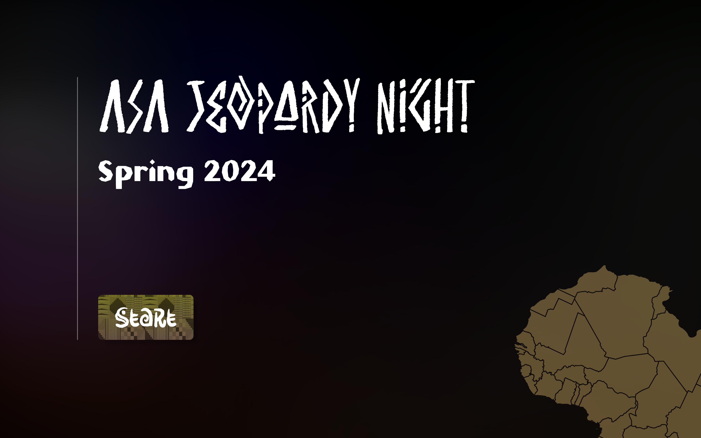
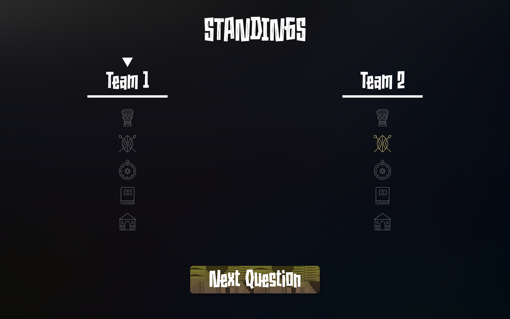
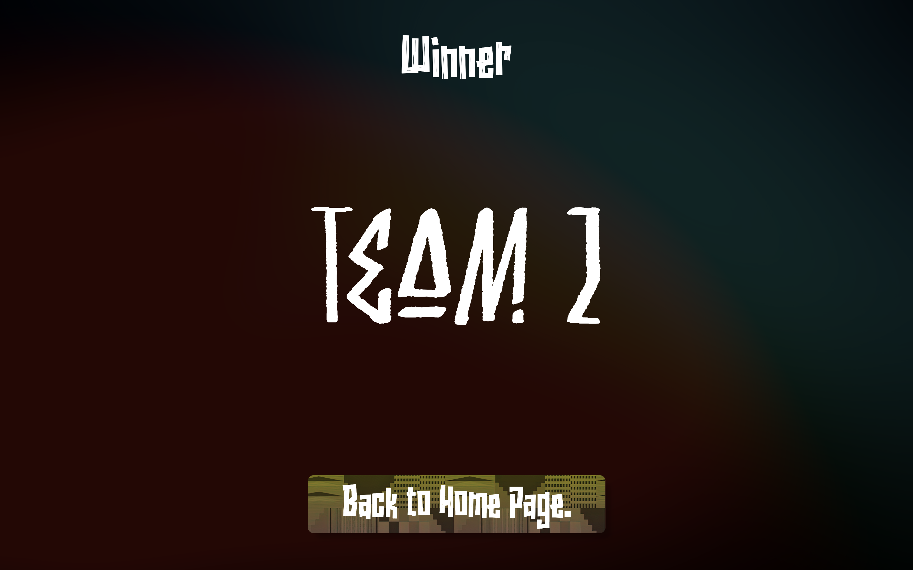

# Trivia Night 2024 Website
|                                                                        |                                                                        |
| ---------------------------------------------------------------------- | ---------------------------------------------------------------------- |
|                  |           |
|  |  |
|              |                    |

This is the code for the Spring 2024 Trivia Night website for the African Students' Association. It's made with Typescript, using Vite + React for the Frontend and Express for the Backend.

## Starting the Website
After cloning the repo, run `npm install` in the root folder to install the required packages.

Then, run `npm run server` in one terminal and `npm run dev` in another to start the backend and frontend respectively. Then, navigate to the localhost link given by the `npm run dev` command (should be [http://localhost:5173](http://localhost:5173)).

## Game Format
The game's format is based loosely off of the app "Trivia Crack", where teams compete to be the first to answer questions from six different categories. 

In this game, teams take turns answering questions from five categories: History, Entertainment, Sports, Government, and Geography. When a team answers a question from a category correctly, that category is "filled". To win, a team must fill all five categories.

The game proceeds in rounds, with every team answering a random question from a random category they haven't filled within a round. If at the end of a round, no team has filled all five categories, the game continues. If one team has filled all five categories and no other team has, the game stops and that team is declared the winner.

If multiple teams have filled all their categories at the end of the round, those teams are put into sudden death, where fully random questions are chosen from any category, and teams who don't answer a question correctly are removed from sudden death until there is one team standing. If all sudden death teams answer incorrectly for a round, sudden death will continue with the same teams that were in the previous round.

## Basic Website Structure
The website's frontend exists in the [`client`](/client/) folder. This folder houses all React Components and CSS styling used for the website. The website's backend exists in the [`server`](/server/) folder. This folder houses the code for game's logic.

The questions used to make the website can be found in [`official_asa_questions.json`](./server/official_asa_questions.json).